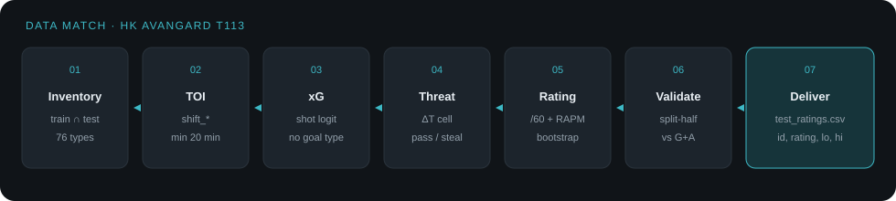
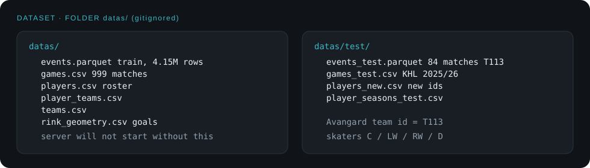
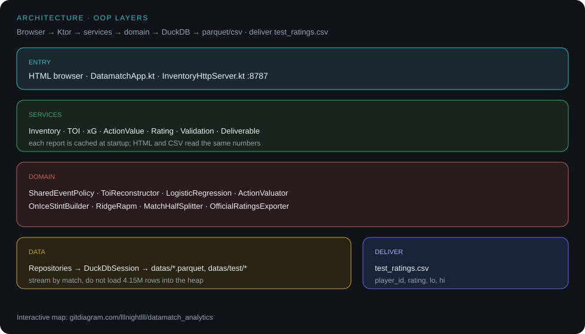

# Datamatch Analytics

Оценка **полевых игроков** хоккея по событийным данным: не счёт матча, не имена, не «точность 87% на тесте».

Метод учится на **999 матчах** train и применяется к **84 матчам ХК «Авангард»** (`T113`, КХЛ 2025/26). Рейтинг — ценность действий на 60 минут плюс RAPM-контекст партнёров и соперников, с bootstrap-интервалом. Вратари не оцениваются.



| | |
|---|---|
| Стек | Kotlin 2.2 · JVM 21 · Gradle · Ktor 3.2 · DuckDB 1.5 · HTML/CSS/JS |
| Интерфейс | `http://127.0.0.1:8787` |
| Сдача | `test_ratings.csv` — `player_id`, `rating`, `lo`, `hi` |
| Данные | папка **`datas/`** (в git её нет — её нужно положить самому) |

---

## Содержание

1. [Как запустить](#как-запустить)
2. [Папка `datas/`](#папка-datas)
3. [Структура проекта](#структура-проекта)
4. [Как работает аналитика](#как-работает-аналитика)
5. [Почему именно так](#почему-именно-так)
6. [API и экраны](#api-и-экраны)
7. [Конфигурация без hardcode](#конфигурация-без-hardcode)
8. [Тесты](#тесты)

---

## Как запустить

Нужны **JDK 21+** (Gradle сам подтянет toolchain 21 через Foojay) и исходные таблицы в `datas/`.

### 1. Клонировать репозиторий

```bash
git clone https://github.com/lllnightlll/datamatch_analytics.git
cd datamatch_analytics
```

### 2. Добавить датасет — папка `datas/`

Каталог **не коммитится** (см. `.gitignore`). Без него `AppConfig` падает на старте: «Папка данных не найдена».

Положите файлы так:

```
datamatch_analytics/
└── datas/
    ├── events.parquet
    ├── games.csv
    ├── players.csv
    ├── player_teams.csv
    ├── teams.csv
    ├── rink_geometry.csv
    └── test/
        ├── events_test.parquet
        ├── games_test.csv
        ├── players_new.csv
        └── player_seasons_test.csv
```



Если датасет уже лежит в `data/` вместо `datas/`, приложение найдёт его само. Явный путь:

```bash
# Windows PowerShell
$env:DATAMATCH_DATA_DIR = "C:\path\to\datas"

# Unix
export DATAMATCH_DATA_DIR=/path/to/datas
```

### 3. Собрать и запустить

Windows:

```powershell
.\gradlew.bat test
.\gradlew.bat run
```

macOS / Linux:

```bash
./gradlew test
./gradlew run
```

`run` стартует из **корня репозитория** (`workingDir = projectDir`), heap **2 GB** — иначе ridge на 999 матчах не помещается. Первый запуск **считает все отчёты до открытия порта** (~20–40 с): инвентарь, ТОИ, xG, угроза, рейтинги, split-half, CSV.

Когда в логе появится Ktor на `127.0.0.1:8787`:

| Экран | URL |
|---|---|
| Инвентарь | http://127.0.0.1:8787/ |
| Время на льду | http://127.0.0.1:8787/toi.html |
| Ожидаемые голы | http://127.0.0.1:8787/xg.html |
| Ценность действий | http://127.0.0.1:8787/threat.html |
| Рейтинги | http://127.0.0.1:8787/ratings.html |
| Split-half | http://127.0.0.1:8787/validate.html |
| Сдача CSV | http://127.0.0.1:8787/deliver.html |

Проверка API:

```bash
curl.exe http://127.0.0.1:8787/api/health
```

Ожидается `"step":"7-csv"`. Официальный файл пишется в корень: `test_ratings.csv` (тоже в `.gitignore`).

Порт **8787**, а не 8080: на Windows 8080 часто занят. Сменить: `DATAMATCH_PORT=9090`.

---

## Папка `datas/`

| Файл | Роль |
|---|---|
| `events.parquet` | ~4,15 млн событий train (101 `event_type`) |
| `games.csv` | 999 матчей, 12 лиг, `rink_type` |
| `players.csv` / `player_teams.csv` / `teams.csv` | состав, позиция, клуб |
| `rink_geometry.csv` | ворота по `european_60x30`, `nhl_61x26`, `finnish_60x28` |
| `test/events_test.parquet` | события 84 матчей Авангарда |
| `test/games_test.csv` | календарь test |
| `test/players_new.csv` | игроки, которых нет в train |
| `test/player_seasons_test.csv` | сезон test |

**Политика утечки:** в модель не входят типы событий, которых нет в test. Пересечение train ∩ test — **76 типов**; 25 train-only (faceoff, icing, penalty, …) отбрасываются.

**Позиции рейтинга:** `C`, `LW`, `RW`, `D`. Вратари (`G`) в CSV не попадают. Пустая позиция в CSV обрабатывается как неизвестная, без NPE.

---

## Структура проекта

Интерактивная схема репозитория: **[gitdiagram.com/lllnightlll/datamatch_analytics](https://gitdiagram.com/lllnightlll/datamatch_analytics)**.



```
datamatch_analytics/
├── datas/                          ← датасет, не в git
├── frontend/                       HTML, CSS, JS по шагам
├── src/main/kotlin/app/
│   ├── DatamatchApp.kt             сборка графа объектов
│   ├── config/                     пути, порт, имена файлов
│   ├── data/                       DuckDB-репозитории
│   ├── domain/                     чистая логика без HTTP
│   │   ├── catalog/                семейства событий
│   │   ├── toi/                    смена → секунды
│   │   ├── xg/                     логит броска
│   │   ├── threat/                 сетка T и Δ
│   │   ├── rating/                 стинты, RAPM, CSV
│   │   ├── validate/               split-half
│   │   └── math/                   линейная система
│   ├── service/                    оркестрация train → test
│   └── api/                        Ktor + DTO
├── src/main/resources/             *-rules.json, event-families.json
├── src/test/kotlin/                юнит-тесты домена
└── test_ratings.csv                появляется после запуска
```

Слои как на [GitDiagram](https://gitdiagram.com/lllnightlll/datamatch_analytics):

| Слой | Что делает |
|---|---|
| **Вход** | `DatamatchApp` поднимает DuckDB и Ktor; браузер бьёт в HTTP API |
| **Данные** | репозитории читают parquet/CSV через `DuckDbSession` |
| **Сервисы** | инвентарь, xG, ценность, ТОИ, рейтинг, валидация, сдача |
| **Домен** | реконструкция ТОИ, логит, `ActionValuator`, стинты, ridge RAPM, половины матчей |
| **Сдача** | `DeliverableService` → `OfficialRatingsExporter` |

Зависимости рейтинга: ТОИ + кредиты действий + стинты + RAPM. Валидация на train использует те же стинты и кредиты, но **другие матчи** (чёт/нечет `match_id`).

---

## Как работает аналитика


На старте сервисы считаются **один раз** и отдаются всем страницам. Порядок жёсткий: сетка угрозы и xG — только train; кредиты и RAPM test — уже готовой сеткой.

### 1. Инвентарь и общие типы

`DatasetInventoryService` считает матчи, игроков, геометрию площадок и каталог `event_type`. `SharedEventPolicy` оставляет типы из пересечения train и test. Семейства (`shot`, `pass`, `steal`, …) заданы в `event-families.json`, не в коде.

### 2. Время на льду

События `shift_*`: вход — заполнен `actor`, выход — заполнен `other` (часто `actor` пустой). Конец периода закрывает всех, кто ещё на льду. Период `0` (буллиты) игнорируется.

5-на-5 здесь — **6 против 6** (`n_home = n_away = 6`): пятеро полевых плюс вратарь в счётчике смены. В рейтинг идут полевые с **≥ 20 минут** test ТОИ.

### 3. Ожидаемые голы

Голы в датасете — **отдельные события**, не «shot с флагом гол». Модель — логистическая регрессия на попытках (`shot_*` + `goal`), признаки:

- расстояние до чужих ворот и квадрат;
- угол;
- зона атаки;
- 5v5;
- лишние свои относительно соперника.

Координаты атаки: команда актора играет **в сторону x > 0**. `rink_type` задаёт ворота, не «средняя КХЛ». Holdout для калибровки — хеш `match_id`, не случайные броски из одного матча.

xG **не** является финальным рейтингом: это якорь «что такое опасный бросок» для сетки угрозы и честная база в split-half.

### 4. Сетка угрозы и ценность действия

На train, только shared-типы, без периода 0:

\[
T(\text{клетка}) = P(\text{бросок своей команды в ближайшие } L \text{ событий} \mid \text{клетка})
\]

Клетка **3 м**, lookahead **12**, слабые клетки сжимаются к глобальной частоте (empirical Bayes, `priorStrength = 80`).

| Действие | Ценность |
|---|---|
| Завершённый пас | \(T(\text{куда}) - T(\text{откуда})\) |
| Отбор | \(+T\) в точке |
| Потеря / неудачный пас | \(-T\) |
| Вход в зону | \(T - T_{\text{нейтраль}}\) |
| Выход из своей | \(T - T_{\text{своя зона}}\) |

Не оцениваются вслепую 101 dummy-тип: faceoff в train есть, в test нет — коэффициент был бы мусором.

### 5. Рейтинг на 60 минут и RAPM

Сырая сумма Δ по игроку зависит от льда. Поэтому:

1. **AV / 60** — сумма кредитов, делённая на минуты ТОИ.
2. **Стинты 5v5** — отрезки, пока состав на льду не меняется (`OnIceStintBuilder`).
3. **Ridge RAPM** — отклик: (ценность хозяев − ценность гостей) в пересчёте на час; свои игроки `+1`, соперники `−1`, площадка — dummy минус базовая. Свободный член **не** штрафуется. \(\lambda = 4000\): диагональ Gram — секунды ТОИ, маленькая λ раздувает оценки.
4. **Shrinkage** к нулю при малом ТОИ (`shrinkPriorMinutes = 40`).
5. **Bootstrap по матчам** (160 реплик, seed 113): 2,5% и 97,5% дают `lo` / `hi`. Интервал всегда приводится к `lo ≤ rating ≤ hi`.

Тестовые 84 матча **не** участвуют в подборе λ и сетки T.

### 6. Split-half на train

999 матчей сортируются по `match_id`: чётные — fit, нечётные — out. На fit считается тот же рейтинг, на out — G+A / 60, броски / 60, плюс-минус. Корреляции (Spearman / Pearson) — **доказательство на train**, не метрика «успеха на Авангарде».

Типичная картина: броски предсказывают G+A лучше RAPM. Это ожидаемо: рейтинг про **создание угрозы**, а не про реализацию. Сырой AV без нормы на время коррелирует с AV/60, но плохо с голами — ещё один аргумент делить на минуты.

### 7. Официальный CSV

Только полевые с ТОИ ≥ порога, сортировка по `player_id`, числа через **точку** (`Locale.US`), 4 знака. Колонки строго четыре — как в ТЗ сдачи.

---

## Почему именно так

Решения зафиксированы в JSON и классах, не в магических числах по файлам.

### Kotlin + HTML, не Jupyter как ядро

Расчёт должен быть воспроизводимым сервисом: один процесс, одни числа в UI и в CSV. Jupyter остаётся тонкой обёрткой над API, если понадобится тетрадка для жюри. OOP-слои (config → data → domain → service → api) держат DuckDB и HTTP подальше от формул.

### DuckDB JDBC, не pandas в памяти

`events.parquet` ~54 МБ сжатый, миллионы строк. DuckDB читает parquet на месте, репозитории **стримят по матчам**. Полный Gram на каждый из 500 train-матчей в валидации давал OOM — ridge на train считается **одним** Gram (`RidgeRapm.fit`), bootstrap на test компилирует более короткие матчи.

### Только пересечение типов событий

Иначе модель «видит» вбрасывания и удаления, которых в test нет, и переносит шум. 76 shared-типов — единственный честный словарь.

### ТОИ из `shift_*`, не из «кто в событии»

Событие не говорит, кто был на льду. Смена: вход актора, выход `other`, закрытие периода без актора. Буллиты (period 0) выкинуты — это не 5v5 и не равный хоккей.

### xG без dummy «тип = гол»

Если в признаки положить `event_type = goal`, логит выучит тавтологию. Признаки — геометрия и численность. Три геометрии площадок важнее двенадцати названий лиг: КХЛ и ВХЛ делят европейский лёд.

### Угроза, а не 101 коэффициент события

«Пас» в своей зоне и «пас» под ворота — разные вещи. Клетка 3 м грубее сантиметров, зато устойчива. Lookahead 12 — компромисс: слишком короткий не видит атаку, слишком длинный приписывает чужой бросок.

### RAPM после /60, не вместо

Один сильный партнёр раздувает сырой AV. Стинты 5v5 и ridge отделяют игрока от звена. λ подобрана под **секунды** в диагонали, не «как в статье про NBA». Эффект площадки — `rink_type`, не 12 лиг с пустыми ячейками.

### Bootstrap матчей, не игроков

Единица зависимости — игра. Ресэмпл `match_id` с возвращением сохраняет внутриматчевую структуру. Имена в интервал не входят: только id.

### Split-half внутри train

Тест — 84 матча одной команды; на нём нельзя честно мерить обобщение и потом сдавать те же числа. Половинки по глобальному списку матчей (не «нечётные игры игрока») дают чистый дизайн для RAPM: одни и те же составы не рвутся по-разному у каждого игрока.

### CSV: точка, четыре колонки, clamp

`String.format("%.2f")` на `ru_RU` пишет запятую — жюри сломает парсер. Экспортёр фиксирует `Locale.US`. Если квантиль bootstrap чуть разъехался с точечной оценкой, `lo`/`hi` поджимаются, чтобы файл не нарушал инвариант.

### Порт 8787 и heap 2g

Практические ограничения среды, вынесены в Gradle/`DATAMATCH_PORT`, не зашиты в домен.

---

## API и экраны

| Метод | Назначение |
|---|---|
| `GET /api/health` | статус шага |
| `GET /api/inventory` | типы, матчи, политика shared |
| `GET /api/toi` | минуты test, 5v5 |
| `GET /api/xg` | логит, holdout |
| `GET /api/threat` | сетка, кредиты семейств |
| `GET /api/ratings` | RAPM, интервалы, Т113 |
| `GET /api/validate` | Spearman/Pearson на train |
| `GET /api/test-ratings` | метаданные сдачи |
| `GET /api/test_ratings.csv` | тот же файл, что в корне |
| `GET /api/*.csv` | выгрузки шагов |

Статика — папка `frontend/`. Навигация сквозная до экрана «Сдача».

---

## Конфигурация без hardcode

| Переменная | Смысл | По умолчанию |
|---|---|---|
| `DATAMATCH_ROOT` | корень репозитория | `user.dir` |
| `DATAMATCH_DATA_DIR` | parquet/CSV | `<root>/datas` или `<root>/data` |
| `DATAMATCH_FRONTEND_DIR` | HTML | `<root>/frontend` |
| `DATAMATCH_PORT` | HTTP | `8787` |
| `DATAMATCH_RATINGS_CSV` | путь сдачи | `<root>/test_ratings.csv` |

Правила моделей:

| Файл | Что задаёт |
|---|---|
| `event-families.json` | семейства `event_type` |
| `toi-rules.json` | смены, 5v5=6, порог минут, `T113` |
| `xg-rules.json` | типы бросков, holdout |
| `threat-rules.json` | клетка, lookahead, виды Δ |
| `rating-rules.json` | λ, bootstrap, shrink |
| `validation-rules.json` | пороги split-half |
| `deliverable-rules.json` | имя файла, знаки, сортировка |

---

## Тесты

```powershell
.\gradlew.bat test
```

Покрыт домен, не HTTP:

- классификатор семейств и `Position.infer`;
- реконструкция ТОИ;
- признаки броска и логит;
- Bayes-сжатие сетки угрозы;
- ridge (штраф уменьшает норму решения);
- Spearman/Pearson с ничьими;
- экспортёр: 4 колонки, точка, `lo ≤ rating ≤ hi`.

---

## Ограничения (как в брифе)

- Нет прогноза счёта матча.
- Нет реальных ФИО в отчётах.
- Нет заявления «модель угадала test на N%».
- Рейтинг про ценность действий в контексте, не про бомбардиров.
- Датасет в git не входит: без `datas/` проект не запускается.

Интерактивная карта кода: [архитектура на GitDiagram](https://gitdiagram.com/lllnightlll/datamatch_analytics).
